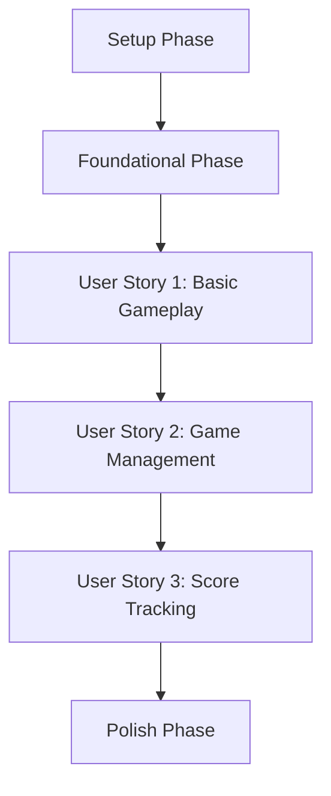

# Implementation Tasks: Tic Tac Toe Web Game

## Overview

Implementation tasks for the Tic Tac Toe web game, organized by user stories and development phases.

## Dependencies

## Tasks

### Phase 1: Setup

- [ ] T001 Initialize TypeScript project in root directory
- [ ] T002 Create core project structure as per plan
- [ ] T003 Configure TypeScript with strict mode in tsconfig.json
- [ ] T004 [P] Set up testing environment with Jest in package.json
- [ ] T005 [P] Create base HTML structure in index.html
- [ ] T006 [P] Create base CSS file in style.css

### Phase 2: Foundational

- [ ] T007 Create game state types in src/models/types.ts
- [ ] T008 Create game interfaces in src/models/interfaces.ts
- [ ] T009 [P] Create utility functions in src/utils/helpers.ts
- [ ] T010 Set up game state management class in src/game/state.ts
- [ ] T011 [P] Create DOM helper functions in src/utils/dom.ts

### Phase 3: User Story 1 - Basic Gameplay

**Goal**: Players can make moves on a 3x3 grid
**Test Criteria**: Single moves can be made alternating between X and O

- [ ] T012 [P] [US1] Create game board layout styles in style.css
- [ ] T013 [US1] Create board management class in src/game/board.ts
- [ ] T014 [US1] Implement game rules in src/game/rules.ts
- [ ] T015 [US1] Add click handlers for cells in src/script.ts
- [ ] T016 [US1] Implement move validation in src/game/rules.ts
- [ ] T017 [US1] Add win detection logic in src/game/rules.ts
- [ ] T018 [US1] Add draw detection logic in src/game/rules.ts
- [ ] T019 [P] [US1] Add base game styles for X and O in style.css

### Phase 4: User Story 2 - Game Management

**Goal**: Players can see game status and reset
**Test Criteria**: Game status is visible and reset works independently

- [ ] T020 [P] [US2] Add game status display HTML in index.html
- [ ] T021 [US2] Implement turn indicator in src/script.ts
- [ ] T022 [US2] Add game reset logic in src/game/state.ts
- [ ] T023 [P] [US2] Style status elements in style.css
- [ ] T024 [US2] Add reset button handler in src/script.ts
- [ ] T025 [P] [US2] Style reset button in style.css

### Phase 5: User Story 3 - Score Tracking

**Goal**: Track wins across multiple games
**Test Criteria**: Scores persist across game resets

- [ ] T026 [P] [US3] Add score display HTML in index.html
- [ ] T027 [US3] Implement score tracking in src/game/state.ts
- [ ] T028 [US3] Add score update logic in src/script.ts
- [ ] T029 [P] [US3] Style score display in style.css

### Phase 6: Polish & Cross-cutting

- [ ] T030 [P] Add winning combination animation styles in style.css
- [ ] T031 Implement winning animation triggers in src/script.ts
- [ ] T032 [P] Add responsive design styles in style.css
- [ ] T033 Add keyboard navigation in src/script.ts
- [ ] T034 [P] Add hover effects for cells in style.css
- [ ] T035 Implement accessibility attributes in index.html

## Parallel Execution Opportunities

### Setup Phase
- Package setup (T001-T004)
- HTML/CSS base (T005-T006)

### User Story 1
- Board layout (T012) with game logic (T013-T018)

### User Story 2
- Status display (T020-T021) with reset functionality (T022-T024)

### User Story 3
- Score display (T026, T029) with tracking logic (T027-T028)

### Polish Phase
- Style improvements (T030, T032, T034) with functionality (T031, T033, T035)

## Implementation Strategy

### MVP (Minimum Viable Product)
1. Complete Setup Phase
2. Complete Foundational Phase
3. Implement User Story 1 (Basic Gameplay)

This provides a playable game with:
- Functioning game board
- Alternating turns
- Win/draw detection

### Incremental Delivery
1. MVP (as above)
2. Add game management (User Story 2)
3. Add score tracking (User Story 3)
4. Polish and enhance

## Task Statistics
- Total Tasks: 35
- Tasks per Story:
  - User Story 1: 8 tasks
  - User Story 2: 6 tasks
  - User Story 3: 4 tasks
- Setup/Foundation: 11 tasks
- Polish: 6 tasks
- Parallel Opportunities: 13 tasks marked with [P]